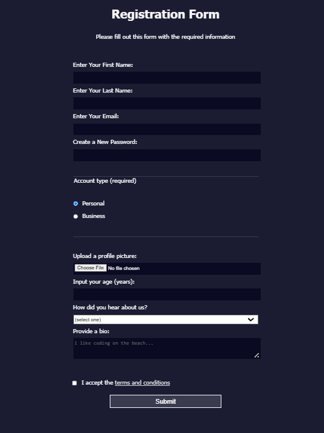

Here's the updated `README.md` file for your project:

---

```markdown
# Basic Registration Form

This is a simple **Basic Registration Form** project created using **HTML** and **CSS**. The form is designed to collect user information in a clean and user-friendly layout.

## Features
- Input fields for:
  - First Name
  - Last Name
  - Email Address
  - Password
  - Account Type
  - Profile Picture
  - Age
  - Referrer
  - Bio
  -Terms and Conditions
- Styled with modern CSS for a clean look
- Submit button for form submission

## Project Structure
The project contains the following files:
- `index.html`: The HTML file that structures the registration form.
- `style.css`: The CSS file that adds styling to the form.

## Getting Started
To run this project locally:

1. Clone the repository:
   ```bash
   git clone https://github.com/harshikab2112/basic-registration-form.git
   ```

2. Navigate to the project directory:
   ```bash
   cd basic-registration-form
   ```

3. Open the `index.html` file in any web browser to view and interact with the form.

## Usage
1. Open the form in your web browser.
2. Fill out the required fields (e.g., First Name, Last Name, Email, Password, etc..).
3. Click the **Submit** button.  
   *(Note: This form is static and does not include backend functionality.)*

## Technologies Used
- **HTML**: To create the structure of the form.
- **CSS**: To style the form and enhance the user experience.

## Example
Below is an example screenshot of the registration form:



## Customization
You can:
- Add new fields or modify the layout by editing `index.html`.
- Adjust colors, fonts, or other styles by modifying `style.css`.

## Contributions
Contributions are welcome! Feel free to fork the repository and submit a pull request with your improvements.

---

**Created with ❤️ by [Harshika Bansal](https://github.com/harshikab2112)**
```

---

Let me know if you'd like any additional tweaks!
